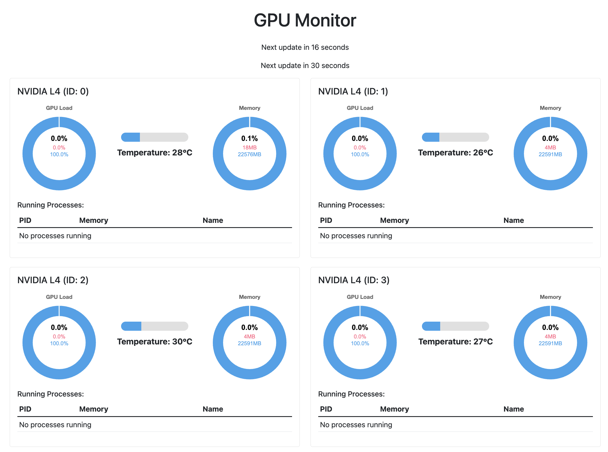

# MNVUSAGE - Monitor NV Usage
For webview to monitor your nvidia gpu status

	

## Just want to try
'''
python main.py
'''

-----

## Use Docker to Host
### Build a container
'''
docker build -t mnvusage .
'''

### Run
'''
docker run -d -p 5555:5000 --gpus all --name mnvusage-container mnvusage
'''

### View

Go to http://localhost:5555

	
